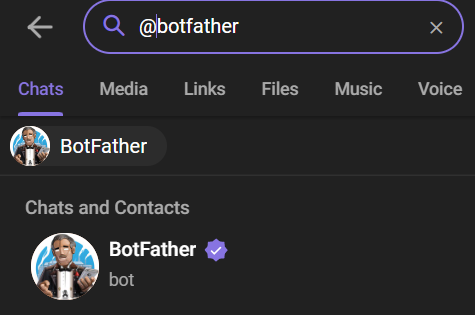
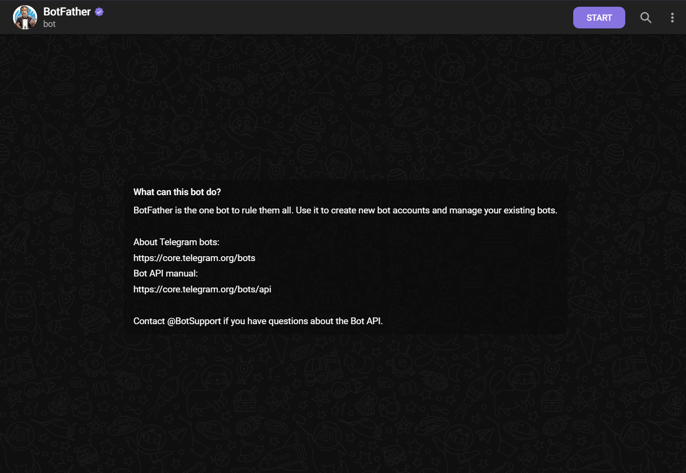
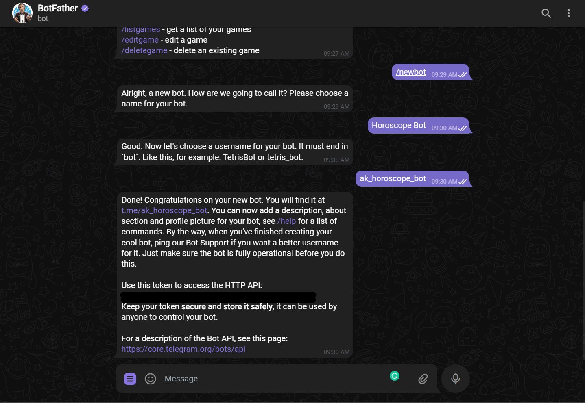
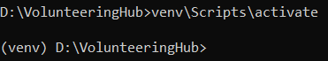

# Legal Terminology Parser

This repository contains the Telegram Bot for searching definitions of terms in Ukrainian legislation.

## Table of Contents:

* [Technologies](#technologies)
* [Installation](#installation)
* [Usage](#usage)
* [License](#License)

## Technologies:


## Installation

First you need to set up a new bot.
To do it, you will need to talk to BotFather. No, he’s not a person – he’s also a bot, and he's the boss of
all the Telegram bots.

Search for `@botfather` in Telegram.



2. Start a conversation with BotFather by clicking on the Start button.



3. Type `/newbot`, and follow the prompts to set up a new bot. The BotFather will give you a token that you will use to
   authenticate your bot and grant it access to the Telegram API.



Note: Make sure you store the token securely. Anyone with your token access can easily manipulate your bot.

In our case, we will store token in `.env` file

This part is taken from
the [freecodecamp tutorial](https://www.freecodecamp.org/news/how-to-create-a-telegram-bot-using-python/).

---

After the bot is created, you can start working with the code.

To clone the repository, use the following command in your terminal:

`git clone https://github.com/OlexiyVasylenkoDev/LegalTerminologyParser.git`

After you cloned the repository to your local machine, navigate to the cloned directory using:
`cd LegalTerminologyParser`

Next, you need to create virtual environment and install all dependencies. To do it, run:

`python -m venv venv`

To activate the virtual environment run:

* On Linux: `source venv/bin/activate`
* On Windows: `venv\Scripts\activate`

If you activated the virtual environment successfully, you will see the virtual environment name in your terminal
prompt. Like this:



Next, you need to install the required dependencies. Run `pip install -r requirements.txt`.
If pip is not installed on your local machine, here is
the [documentation on how to install it](https://pip.pypa.io/en/stable/installation/).

Then, create a `.env` file in the project root directory with the following configurations:

```
TOKEN=*

POSTGRES_DB=*
POSTGRES_USER=*
POSTGRES_PASSWORD=*
POSTGRES_HOST=localhost
POSTGRES_PORT=5432

PGADMIN_DEFAULT_EMAIL=admin@admin.com
PGADMIN_DEFAULT_PASSWORD=admin
```

To run the project, use the following commands:

* On your local machine: `python source/main.py`
* With Docker: `docker-compose up --build`

To run it with Docker, you will obviously need to have Docker and Docker Compose installed on your local machine. If you
don't have
them installed yet, you can follow the instructions [here](https://docs.docker.com/compose/install/)!

Once you have Docker and Docker Compose installed, you need to change the `POSTGRES_HOST` variable in the `.env` file to
the name of your docker-compose postgres service.
https://github.com/OlexiyVasylenkoDev/LegalTerminologyParser/blob/ac034b2c08395fcaeed80f1bbe933069dc689c4a/docker-compose.yml#L10-L11

As you can see, my service is called `database`, therefore, it will look like this: `POSTGRES_HOST=database`.

Finally, you can run the following command:
`docker-compose up --build`.

This will start the bot with database in Docker containers.
Once the containers are up and running, you can go to Telegram and use your bot!

## Usage

The bot three message handlers:

| Command | Description                                                                         |
|---------|-------------------------------------------------------------------------------------|
| /start  | Starts bot instance running                                                         |
| /       | Implements main functionality of the bot. <br/>Search for terms written to the bot. |
| /end    | Ends bot instance running                                                           |

There are also two callback handlers:

| Callback            | Description                                                             |
|---------------------|-------------------------------------------------------------------------|
| pagination_callback | Creates keyboard with multiple pages according to number of terms found |
| answer_callback     | Gets term from database according to the button clicked on keyboard     |

## License

This repository is licensed under the MIT License. See
the [LICENSE](https://github.com/OlexiyVasylenkoDev/LegalTerminologyParser/blob/0cf80243e193606b89c7597a45f1e8adb2417928/LICENSE)
file for more information.